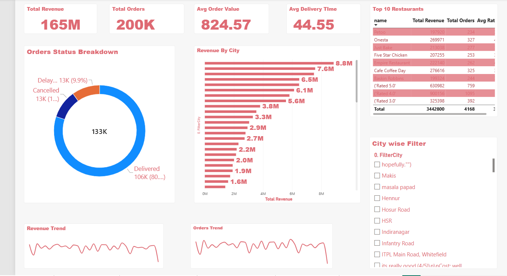
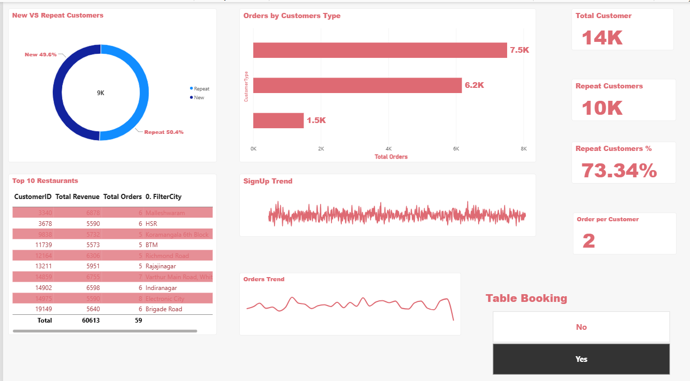
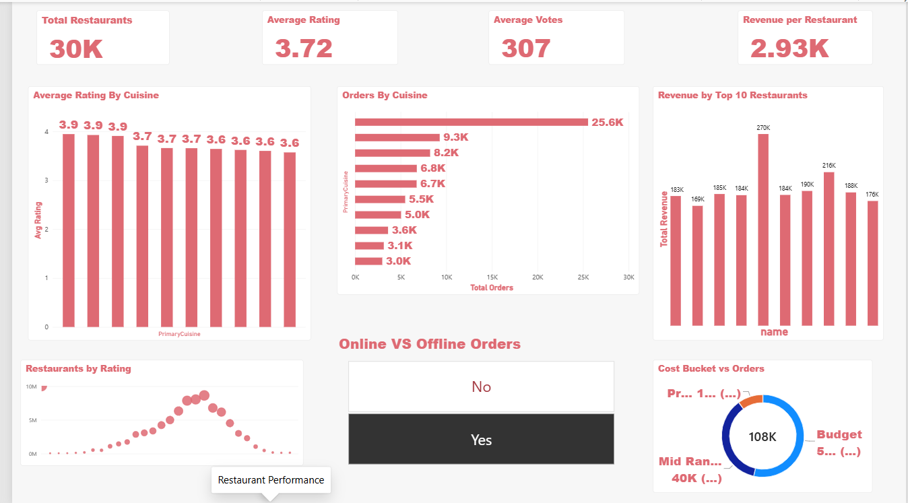
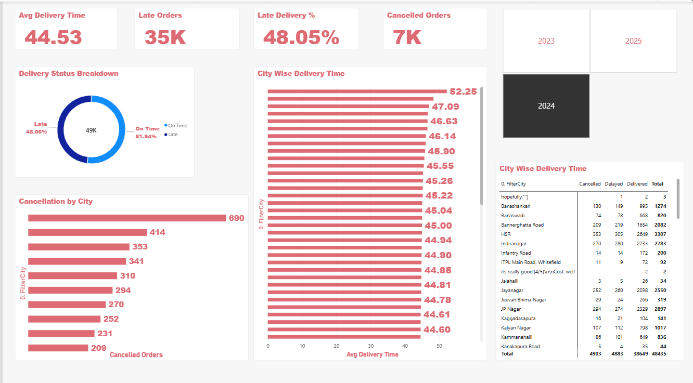
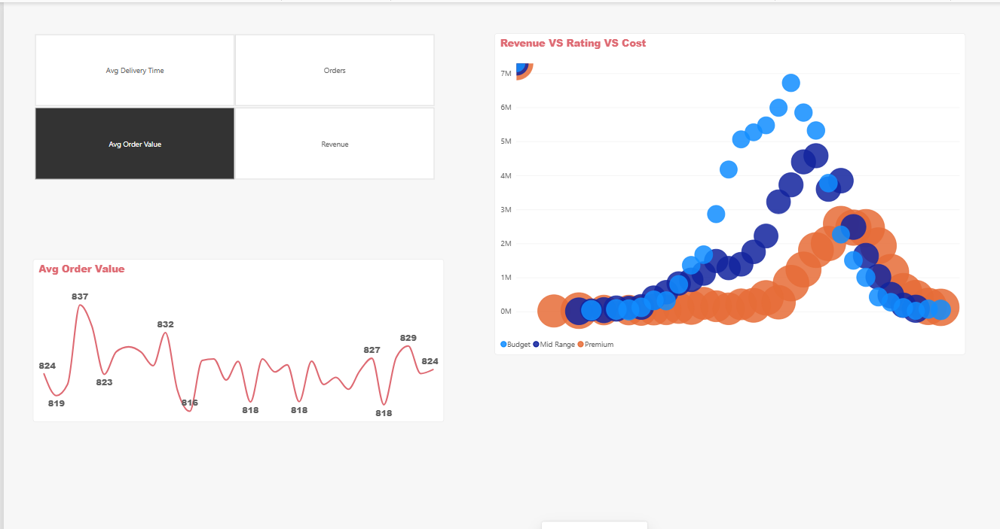
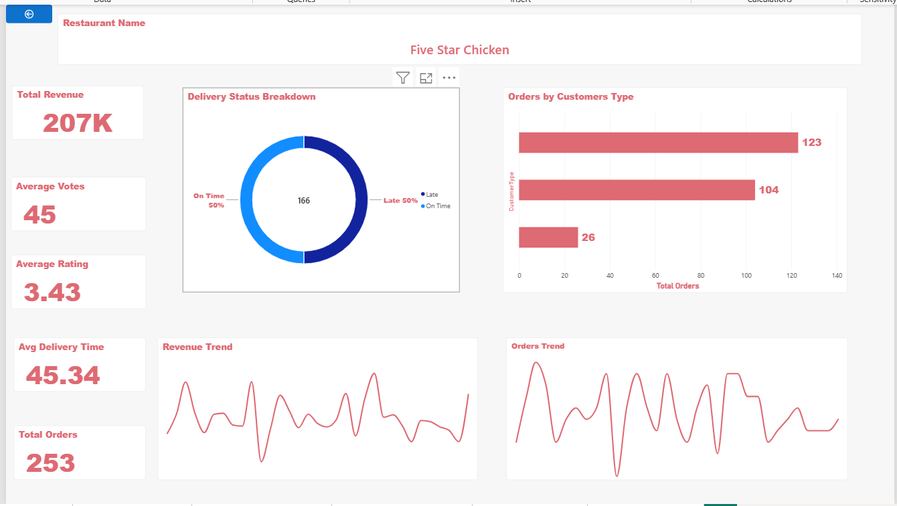

# 🍽️ Restaurant Analytics Dashboard | Power BI

## 📌 Project Overview

An interactive Restaurant Analytics Dashboard developed using
Microsoft Power BI and DAX.

The project analyzes restaurant business performance from multiple
perspectives, including revenue, orders, customer behavior,
restaurant performance, ratings, and delivery operations.

## 🛠️ Tools & Technologies

- Microsoft Power BI
- DAX
- Power BI Data Modeling
- Data Visualization
- Kaggle Dataset

## 📊 Dashboard Pages

### 1. Executive Overview

Provides a high-level overview of restaurant business performance.

Key analysis includes:
- Total Revenue
- Total Orders
- Average Order Value
- Average Delivery Time
- Orders Status Breakdown
- Revenue by City
- Top 10 Restaurants
- Revenue Trend
- Orders Trend

### 2. Customer Analytics

Analyzes customer behavior and customer retention.

Key analysis includes:
- New vs Repeat Customers
- Total Customers
- Repeat Customers
- Repeat Customer %
- Orders per Customer
- Orders by Customer Type
- Customer Sign-up Trend
- Customer-level analysis

### 3. Restaurant Performance

Analyzes restaurant-level and cuisine-level performance.

Key analysis includes:
- Total Restaurants
- Average Rating
- Average Votes
- Revenue per Restaurant
- Average Rating by Cuisine
- Orders by Cuisine
- Revenue by Top Restaurants
- Restaurants by Rating
- Cost Bucket Analysis
- Online vs Offline Orders

### 4. Delivery and Operations

Analyzes delivery efficiency and operational performance.

Key analysis includes:
- Average Delivery Time
- Late Orders
- Late Delivery %
- Cancelled Orders
- Delivery Status Breakdown
- City-wise Delivery Time
- Cancellation by City
- Year-wise analysis

### 5. Advanced Insights

Provides deeper analytical views of the restaurant business.

Key analysis includes:
- Average Order Value Trend
- Revenue vs Rating vs Cost
- KPI Selection
- Revenue and Order Analysis
- Time-based Analysis

### 6. Restaurant Details

Provides detailed analysis for individual restaurants.

Key metrics include:
- Total Revenue
- Total Orders
- Average Rating
- Average Votes
- Average Delivery Time
- Delivery Status
- Orders by Customer Type
- Revenue Trend
- Orders Trend

## 📈 Key DAX Calculations

The project uses DAX calculated columns and measures for:

- Total Revenue
- Total Orders
- Average Order Value
- Average Delivery Time
- Total Customers
- Total Restaurants
- Delivered Orders
- Cancelled Orders
- Cancellation %
- Late Orders
- Late Delivery %
- Repeat Customers
- Repeat Customer %
- Orders per Customer
- Revenue per Restaurant
- Average Rating
- Average Votes
- Revenue YTD
- Orders YTD
- Previous Month Revenue
- Revenue Growth %

## 🔍 Key Business Analysis

The dashboard provides an interactive way to analyze:

- Overall revenue and order performance
- Customer repeat behavior
- Restaurant and cuisine performance
- Restaurant rating and cost segments
- Delivery efficiency
- Cancellation patterns
- City-wise performance
- Revenue and order trends
- Individual restaurant performance

## 📷 Dashboard Screenshots

### Executive Overview

### Customer Analytics

### Restaurant Performance

### Delivery and Operations

### Advanced Insights

### Restaurant Details

## 📁 Project Files

- `Restaurant_analytics.pbix` — Power BI report
- `dataset.xlsx` — Project dataset
- `CALCULATED COLUMNS AND MEASURES.txt` — DAX calculations
- Dashboard screenshots — Visual representation of all report pages

## 🎯 Project Objective

The objective of this project was to transform restaurant-related
data into an interactive Power BI report that enables users to
explore business performance, customer behavior, restaurant
performance, and delivery operations through KPIs and interactive
visualizations.
